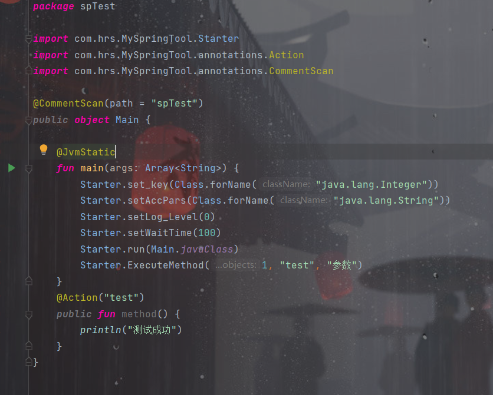

# Spring式 浓缩式 分支处理 框架

## 声明:

### 一切开发旨在学习，请勿用于非法用途

  <h4>
  <li>此框架由GitHhub: <a herf="https://github.com/Kloping"> Kloping </a> 开发</li>
  <li>此框架 是完全免费且开放源代码</li>
  <li>且 仅用于 学习和娱乐<u><b><i>禁止用于非法用途</i></b></u>
</h4>

使用Maven pom.xml

```xml

<dependencies>
    <dependency>
        <groupId>io.github.Kloping</groupId>
        <artifactId>SpringTool</artifactId>
        <version>0.0.4</version>
    </dependency>
</dependencies>
```

使用说明:

框架运行于JVM class 和 jar 环境

### 类注解

- @CommentScan(path): 扫描Controller和实体类的路径
- @Controller  : 用于被CommentScan扫描的类

### 方法注解

- @Bean(id) : 类对象 会扫描 启动类的Bean 和 @Entity类中的Bean
- @Entity(id) :实体类 若存在于扫描路径下 将通过无参构造创建该类
- @Action(表达式): 活动注册
- @After : 当前类中所有活动运行完后运行
- @Before :当前类中所有活动运行完前运行

### 字段注解

- @AutoStand(id): 自动填充 已有的Bean
- @Param(name): 在Action方法参数中使用 用来获取匹配的字符
- @AllMess : 在Action方法参数中使用 用来获取匹配的全部字符

## 如何启动

**通过com.hrs.mySpringTool.Starter类**

### 一,代码配置

- Starter.set_key(Class);
    - 设置唯一标志的类型
- Starter.setWaitTime(Long);
    - 设置每个活动最大运行时间
- Starter.setAccPars(Class...);
    - 设置接收的参数
- Starter.setLog_Level(int);
    - 设置日志输出门槛
- Starter.run(Class);
    - 启动 参数一般为 当前类 且 需要@CommentScan注解

### 二,启动匹配

- Starter.ExecuteMethod(Obj...);

- 其值必须为此格式 0.唯一ID类型 1.String 类型 2+ 接受参数类型

#### 如图


其中第二个参数("test") 作用于匹配 Action(内容)

#### 如 执行后将运行 test1方法

```java

@CommentScan(path = "controller")
public class Main {
    public static void main(String[] args) {
        Starter.set_key(Long.class);
        Starter.setWaitTime(10L);
        Starter.setAccPars(String.class, Number.class);
        Starter.setLog_Level(0);
        Starter.run(Main.class);
        // ==========================唯一ID, 匹配Action 参数1 参数2
        Starter.ExecuteMethod(1L, "test1", "字符参数", 347400676);
    }

    @Action("test1")
    public void test1() {
        System.out.println("测试成功");
    }
}
```

### 三,运行时参数自动装配

在上面案例中 若想获取 匹配时携带的参数 可在Action方法内添加参数

它将自动装配

例:

```java
public class Main {
    @Action("test1")
    public void test1(String p1) {
        System.out.println(p1);
    }
}
```

这将输出参数 "字符参数"

```java
Starter.ExecuteMethod(1L,"test1","字符参数",347400676);
```

### 四,高级匹配 自动填充

@Action(内容)

内容可为任何字符 <u>**但这将只匹配与之完全相同的活动**</u>

若想匹配其他表达式的则需要写入正则表达式

在上面的案例中

此方法也将匹配

```java
public class Main {
    @Action("test\\d")
    public void testN(String p1) {
        System.out.println(p1);
    }
}
```

若两方法同时存在则都将运行<br>
_**但强烈不建议这样做**_<br>
_**强烈建议一个只有一个Action被匹配**_

#### 如何获取正则匹配的内容

 ```java

@CommentScan(path = "controller")
public class Main {
    public static void main(String[] args) {
        Starter.set_key(Long.class);
        Starter.setWaitTime(10L);
        Starter.setAccPars(String.class, Number.class);
        Starter.setLog_Level(0);
        Starter.run(Main.class);
        // ==========================唯一ID, 匹配Action 参数1 参数2
        Starter.ExecuteMethod(1L, "test9", "字符参数", 347400676);
    }

    @Action("test<\\d=>par>")
    public void testN(@Param("par") String n) {
        System.out.println("测试成功" + n);
    }
}
```

这将输出:

    测试成功9

匹配模式

    @Action("test<正则>") 等同于 @Action("test正则")
    如
    @Action("test<\\d>") 等同于 @Action("test\\d")

但这将无法获取\\d 匹配的内容

     @Action("test<正则=>name>")
     => 指向剪头 这将把 正则匹配的内容填充给方法@Param("name")参数

如上代码

    @Param(内容) T t

T 类型 可为 <br> **_String_**  int long float double boolean 以及其包装类型<br>

内部将自动转换类型 若转换失败 则为 String

### 五 运行流程

所有注解就剩 两个 _@After_ _@Before_ <br>
显然 这是活动运行之前和之后的方法 <br>
它们必须存在于<u>@Controller</u> 类 之内 <br>
当该类<u>Controller</u> 的 活动触发时 <br>
若存在@Before方法 则 会先运行 <br>
运行期间 若
抛出 [NoRunException](https://github.com/Kloping/my-spring-tool/blob/master/src/main/java/com/hrs/MySpringTool/exceptions/NoRunException.java)
异常 则会阻止 整个 运行流程 <br>
After 与之 不同的就是 之前 和 之后<br>

#### 特别的 Starter 还有两个配置

```java

public class Main {
    static {
        Starter.setAllAfter(new Starter.AllAfterOrBefore(Starter.AllAfterOrBefore.State.After) {
            @Override
            public void run(Object o, Object[] objects) throws NoRunException {
                System.out.println("所有类活动运行之后");
            }
        });
        Starter.setAllBefore(new Starter.AllAfterOrBefore(Starter.AllAfterOrBefore.State.Before) {
            @Override
            public void run(Object o, Object[] objects) throws NoRunException {
                System.out.println("所有活动运行之前");
            }
        });
    }
}
```

需要传入 Starter.AllAfterOrBefore 类型 的 抽象类 其 构造参数是<br>
_(Starter.AllAfterOrBefore.State)_ 这是个 枚举 类 且 只有 两个<br>
**Starter.AllAfterOrBefore.State.After**<br>
**Starter.AllAfterOrBefore.State.Before**<br>

意如字意 在 设置 AllAfter (AllBefore) 还可 指定<br>
先运行 Controller 类中的 after (before) 或 先运行 指定的 方法<br>
State.After 将 先运行 Controller 类中的 after (before) 后 运行<br>
State.Before 将 先运行 Controller 类中的 after (before) 前 运行

且 在所有位置
抛出 [NoRunException](https://github.com/Kloping/my-spring-tool/blob/master/src/main/java/com/hrs/MySpringTool/exceptions/NoRunException.java)
异常 都 会阻止 整个 运行流程

### 六, @AutoStand 与 @Entity 这一针对于不懂Spring的 开发者

这里我们定义一个 Interface
```java
public interface BaseService {
    Number add(int a,int b);
}
```
实现它 并 添加注解 @Entity

```java
@Entity("base1")
public class BaseServiceImpl implements BaseService {
    @Override
    public Number add(int a, int b) {
        return a + b;
    }
}
```

在 Controller 中 定义 BaseService 并 添加注解 @AutoStand 

它将自动 实例化 为 BaseServiceImpl
```java

import com.hrs.MySpringTool.annotations.Controller;

@Controller
public class BaseController {
    
  @AutoStand
  BaseService service;

  @Action("计算<.+=>str>")
  public String add(@Param("str") String str) {
    try {
      String[] ss = str.split("\\+");
      Integer a = Integer.parseInt(ss[0]);
      Integer b = Integer.parseInt(ss[1]);
      return "结果" + service.add(a, b);
    } catch (NumberFormatException e) {
      return "格式错误";
    }
  }
}
```

当然在 @Entity(id) 在 @AutoStand(id) 指定 ID

##更多API 请查看 [更新日志](https://github.com/Kloping/my-spring-tool/releases)

================================================

### _**Kotlin 使用 这里不多做介绍 直接上图**_



## 如遇 Bug 请及时联系 感谢 您的 阅读 与 使用
